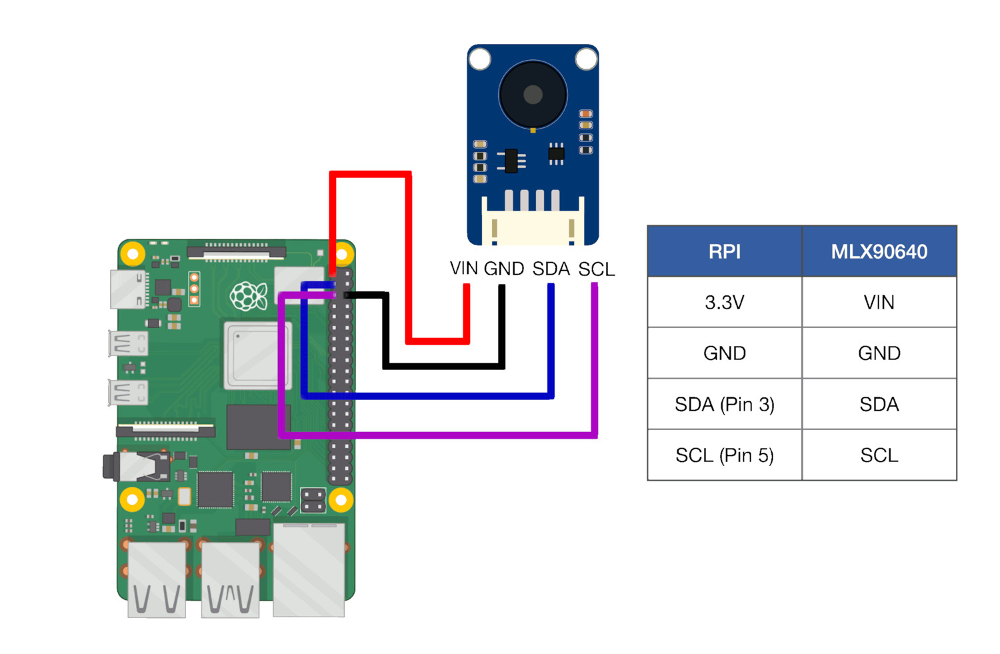

# MLX90640-Thermal-Camera-API-on-Raspberry-Pi-4-using-Flask
A description on how to set up an api that returns the thermal values read by an MLX90640 thermal camera that is connected to a Raspberry Pi 4.

## Required Materials
For this you will need:
- Raspberry Pi 4 (3 might also work but I cannot garatue that it will work/not break your Pi)
- MLX90640 Thermal Camera
- Apropiate power supply for your Raspberyy Pi
- A method of SSHing into the Pi
- (If your Pi does not have an operating system) Micro SD-card. Make sure this card does not contain important files as the card will be wiped when we use it.
- (If your Pi does not have an operating system) SD-card reader
- Soldering equipment
- 4 Wires

## Seting up your Raspberyy Pi
To begin you will need a Raspberry Pi and an SD-card.
Put your SD-card into and SD-cad reader that is connected to a computer (**Not your Pi**).
Download [Raspberry Pi Imager](https://www.raspberrypi.com/software/).
Choose the default OS (Raspberry Pi OS (32-bit) at the time of writing). This shuld be the one at the top of the lst when you clicked "Choose OS".

For storage click the SD-card that you want to use with your Pi.
Note that this card will have to remain in your Pi as long as you want it to function as the Pi does not have any built in storage and uses your SD-card to store things like the code we will be writing later.

Before clicking "Write" click the options button in the lower right (the gear icon).
Here we will need to enable and change most settings. I will go through them in order that they apear in in the version of the software that I am using. Note that this can and has changed between updates to the software.
One important thing to note here is that if you ever feel the need to reinstall your Pi compleatly, just shut down the Pi, take out the SD-card from it, and follow the bellow steps again. As the Pi does not have storage built in, this will compleatly wipe the OS and all contents on the SD-card and install a fresh OS.
- Enable "Set hostname". In the text field next to the button write the name you want your Pi to have. This can be used to SSH into the device, ping it, or other this instead of the Pi's IP-adress.
- Enable "SSH" and click "Use password authentication" this is how we will operate the Pi.
- Enable "Set username and password". Enter the _username_ and _password_ you want in their respective fields. This is what you will use to log into your Pi. **Write these down as you cannot acces your Pi without them**
- Enable "Configure wireless LAN". In "SSID" write the name of the network you want your Pi to connect to. It is reccomended that this network is the same network that is connected to the computer you want to use to SSH into your Pi. In "Password" enter the password of the network that you entered in "SSID". In "Wireless LAN country" sellect the country that you are in. For example, I am in Sweden so I sellected "SE". If you're in the UK this will be "UK", in the USA "US", etc.
- Enable "Set locale settings" and sellect your time zone. Also sellect your Keyboard layout, for me this is "se". If you are using an American keyboard layout it will be "us", etc.

Click "save" at the bottom of this window, then click "Write" and wait for your OS to be writen to the SD-card.
Now incert the SD-card into your Pi **while it is _NOT_ connceted to power**.
Connect the Pi to your power supply and wait for 5 minutes.
Open a cmd window and write "ping [the name of your Pi]" and hit enter.
If your Pi does not respond, you most likely did not configure your wireless lan correctly during OS-setup and will need to redo that process. **Unplugg your power supply before removing the SD-card**.
If it does respond, proceed to the next step.

## Wireing the MLX90640 camera to your Pi
Unplugg your power supply from your Pi.
Solder one of the connectors that came with your camera to the connectors on your camera.
Wireing should be done like the image bellow.
Note that the 3-6V, GND, SDL and SCL connections on your cameras board are not in the same order as the ones on on the image.

Connect you Pi to your power supply and wait for 5 minutes.

## Preparing your Pi
We will now be SSHing into your Pi. For this I will be using PuTTY, found [here](https://putty.org/).
Open PuTTY and in the field "Host Name" write the name that you gave your Pi earlier (you should not put ".local" afterward. Only input the name) and click "Open" in the bottom right.
Now write the username that you sellected, press neter, and then write the password that you entered. The password will not be shown in the terminal while you are writing it, but is is being writen.

We now need to install som things via some different commands. Enter them one at a time in the order that they are writen bellow:

