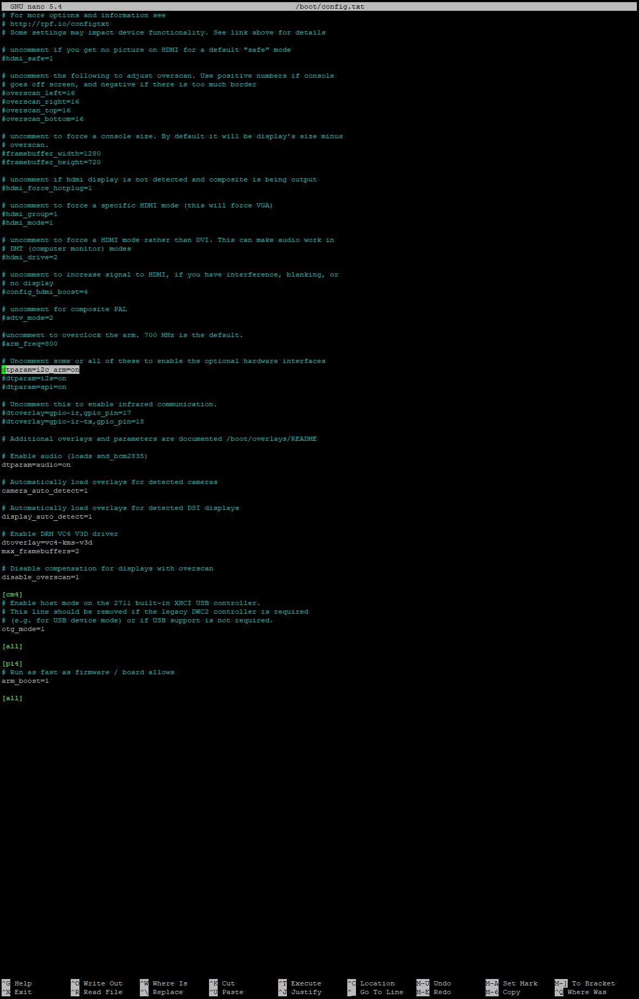
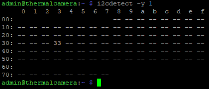
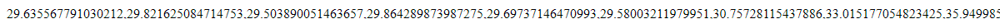
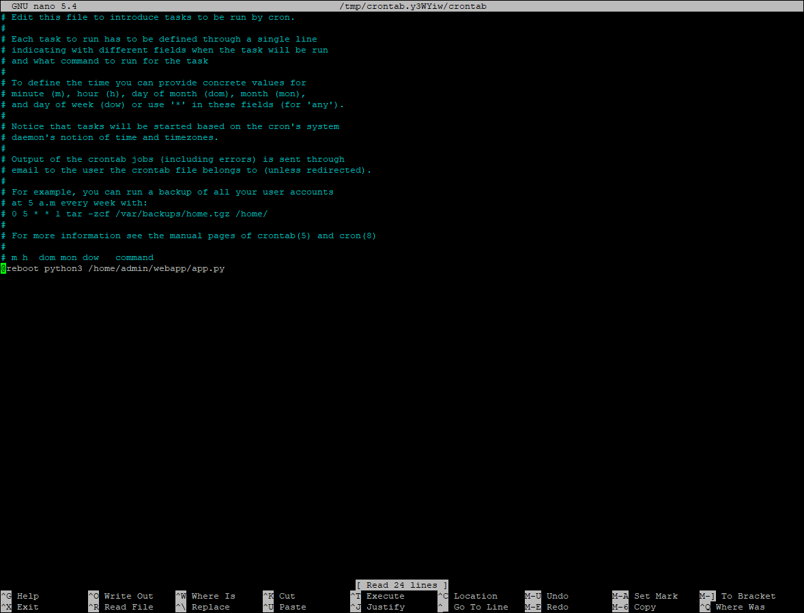

# MLX90640-Thermal-Camera-API-on-Raspberry-Pi-4-using-Flask
A description on how to set up an api that returns the thermal values read by an MLX90640 thermal camera that is connected to a Raspberry Pi 4.

## Required Materials
For this you will need:
- Raspberry Pi 4 (3 might also work but I cannot guarantee that it will work/not break your Pi)
- MLX90640 Thermal Camera
- Appropriate power supply for your Raspberry Pi
- A method of SSHing into the Pi
- (If your Pi does not have an operating system) Micro SD-card. Make sure this card does not contain important files as the card will be wiped when we use it.
- (If your Pi does not have an operating system) SD-card reader
- Soldering equipment
- 4 Wires

## Setting up your Raspberry Pi
To begin you will need a Raspberry Pi and an SD-card.
Put your SD-card into and SD-cad reader that is connected to a computer (**Not your Pi**).
Download [Raspberry Pi Imager](https://www.raspberrypi.com/software/).
Choose the default OS (Raspberry Pi OS (32-bit) at the time of writing). This should be the one at the top of the lst when you clicked "Choose OS".

For storage click the SD-card that you want to use with your Pi.
Note that this card will have to remain in your Pi as long as you want it to function as the Pi does not have any built-in storage and uses your SD-card to store things like the code we will be writing later.

Before clicking "Write" click the options button in the lower right (the gear icon).
Here we will need to enable and change most settings. I will go through them in order that they appear in in the version of the software that I am using. Note that this can and has changed between updates to the software.
One important thing to note here is that if you ever feel the need to reinstall your Pi completely, just shut down the Pi, take out the SD-card from it, and follow the bellow steps again. As the Pi does not have storage built in, this will completely wipe the OS and all contents on the SD-card and install a fresh OS.
- Enable "Set hostname". In the text field next to the button write the name you want your Pi to have. This can be used to SSH into the device, ping it, or other this instead of the Pi's IP-address.
- Enable "SSH" and click "Use password authentication" this is how we will operate the Pi.
- Enable "Set username and password". Enter the _username_ and _password_ you want in their respective fields. This is what you will use to log into your Pi. **Write these down as you cannot access your Pi without them**
- Enable "Configure wireless LAN". In "SSID" write the name of the network you want your Pi to connect to. It is recommended that this network is the same network that is connected to the computer you want to use to SSH into your Pi. In "Password" enter the password of the network that you entered in "SSID". In "Wireless LAN country" select the country that you are in. For example, I am in Sweden, so I selected "SE". If you're in the UK this will be "UK", in the USA "US", etc.
- Enable "Set locale settings" and select your time zone. Also, select your Keyboard layout, for me this is "se". If you are using an American keyboard layout it will be "us", etc.

Click "save" at the bottom of this window, then click "Write" and wait for your OS to be written to the SD-card.
Now insert the SD-card into your Pi **while it is _NOT_ connected to power**.
Connect the Pi to your power supply and wait for 5 minutes.
Open a cmd window and write "ping [the name of your Pi]" and hit enter.
If your Pi does not respond, you most likely did not configure your wireless Lan correctly during OS-setup and will need to redo that process. **Unplug your power supply before removing the SD-card**.
If it does respond, proceed to the next step.

## Wiring the MLX90640 camera to your Pi
Unplug your power supply from your Pi.
Solder one of the connectors that came with your camera to the connectors on your camera.
Wiring should be done like the image bellow.
Note that the 3-6V, GND, SDL and SCL connections on your cameras board are not in the same order as the ones on the image.


Connect you Pi to your power supply and wait for 5 minutes.

## Configuring your Pi
We will now be SSHing into your Pi. For this I will be using PuTTY, found [here](https://putty.org/).
Open PuTTY and in the field "Host Name" write the name that you gave your Pi earlier (you should not put ".local" afterward. Only input the name) and click "Open" in the bottom right.
Now write the username that you selected, press enter, and then write the password that you entered. The password will not be shown in the terminal while you are writing it but is being written.

We now need to install some things via some different commands. To copy the command into the SSH-terminal you cannot use the usual _Ctrl+V_ shortcut, but instead need to right click the terminal portion of the window. Enter them one at a time in the order that they are written:
`sudo apt install python3-numpy` once prompted enter "y".
`sudo apt install python3-smbus i2c-tools`
`sudo pip3 install RPI.GPIO adafruit-blinka`
`sudo pip3 install adafruid-circuitpython-mlx90640`.
Now we have to edit enable i2c.
Enter the command `sudo nano /boot/config.txt` and uncomment the following line by removing the "#" in front of the text. Do net edit the actual text.


Now press _Ctrl+S_ and then _Ctrl+X_ to save and exit the config file.
Now reboot your Pi by writing the command `sudo reboot` into the terminal. This is needed to apply the changes we made in the config file.

You will now need to close PuTTY, reopen it, and reconnect to your Pi. When you have connected to it, run the following command `i2cdetect -y 1`.
This will check to see if your MLX90640 camera is detected by i2c. The response you get should look similar to this:


If you do not get a response, make sure that your camera is properly connected to the pins on your Pi.

## Setting up Flask
First run the following commands in the order they are written
`sudo pip3 install flask`
`mkdir webapp`
`cd webapp`
`nano app.py`
Click _Ctrl+S_ and then _Ctrl+X_. Then input the command `cd` then `ls`. The _ls <filename>_ command lists the contents of the file that it is pointed toward. Because we did not point it anywhere, it lists the contents of the directory that we are currently in. Make sure that the _ls_ command listed a directory called "webapp".
Now enter the command `cd webapp` (_cd_ stands for "change directory by the way) and then `ls` again. Make sure that there is a file called "app.py" listed here.
Enter the command `nano app.py` which will let you edit the file.
Copy the bellow code into _app.py_.

```
import time,board,busio
import adafruit_mlx90640
import numpy as np
from flask import Flask

app = Flask(__name__)

i2c = busio.I2C(board.SCL, board.SDA, frequency=400000) #Sets up i2c to work
mlx = adafruit_mlx90640.MLX90640(i2c) #Defines mlx
mlx.refresh_rate = adafruit_mlx90640.RefreshRate.REFRESH_1_HZ #Sets the refresh rate of the camera.

@app.route('/')

def index():
        frame = np.zeros(768) #Creates frame array. Change 768 to the number of pixels that your camera has in total if you are not using an MLX90640. My camera has a resolution of 24x32 which makes the total pixels 768.
        mlx.getFrame(frame) #Gets the temperature information from the camera and enters it into the frame array
        frameString = ','.join(str(x) for x in frame) #Converts frame into a , seperated string
        return frameString #Returns the captured temperature of the camera's pixels as a , seperated string

if __name__ == '__main__':
        app.run(debug=True, host='0.0.0.0') #Enables debug and sets host
```
Press _Ctrl+S_ and then _Ctrl+X_  to save and exit the file.
Enter the command `python3 app.py`.
Now open a browser and go to the IP-adress of your Pi but ender _:5000_ after the adress like so.
```
XXX.XXX.X.XX:5000
```
You should now see an exceedingly long string of numbers like this:


To stop _app.py_ simply press _Ctrl+C_ while in the SSH terminal.

## Running _app.py_ on Pi boot
Now we will make it so that the _app.py_ script that we wrote earlier gets ran automatically when we turn on our Raspberry Pi. This way you don't have to run it again in case your Pi ever turns of for some reason.
This is fairly simple.
Make sure that _app.py_ is not running by pressing _Ctrl+C_ while in the SSH terminal.
First run this command `cd` then `sudo crontab -e`
If prompted, select "nano" by pressing the corresponding number (in my case 1) and then pressing enter.
Add the following line at the very bottom of the file. Make sure to replace "pi" with the username that you set during OS installation and that you have been using to log in to the SSH. In my case this is "admin".


Press _Ctrl+S_ and then _Ctr+X_ to save and exit the file.

Now reboot your Pi by inputting the command `sudo reboot`, wait for a while (possibly a few minutes) and your web page with all the numbers should be back up and running again.
You now have and API where you can get the readings of your MLX90640 camera that update in real time that you can use however you want (However I recommend staying within the bounds of the law)!

Parts of this guide are taken from the following sources:
[Everything Smart Home on YouTube](https://www.youtube.com/watch?v=XRwbcsbh33w)
[Joshua Hrisko on Makers Portal](https://makersportal.com/blog/2020/6/8/high-resolution-thermal-camera-with-raspberry-pi-and-mlx90640)
[The Raspberry Pi Foundation](https://projects.raspberrypi.org/en/projects/python-web-server-with-flask/1)
[Avram Piltch on Tom's Hardware)(https://www.tomshardware.com/how-to/run-script-at-boot-raspberry-pi)
